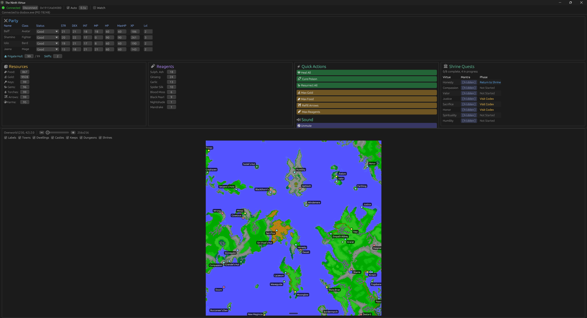

# The Ninth Virtue

The Ninth Virtue: Convenience.

`ninth-virtue` is an unofficial Windows companion app for Ultima V that attaches to a live DOSBox or DOSBox Staging session and turns the game's memory into a second-screen control panel. It surfaces party state, quest progress, map data, and a handful of recovery actions without replacing the original game client.

This is not a ROM hack, not a save-file editor, and not a replacement engine. It reads and writes known Ultima V runtime structures inside the emulator process while the game is running.

## What It Does

- Attaches to a running DOSBox or DOSBox Staging process on Windows
- Locates Ultima V's emulated DOS memory automatically
- Reads party state, inventory, shrine quest progress, map state, and object data
- Provides quick recovery actions such as healing, curing poison, resurrecting the party, refilling arrows, and topping off supplies
- Exposes direct editing surfaces for party and inventory values
- Tracks shrine quest progress with virtue, mantra, and completion state
- Controls the attached DOSBox audio session volume and mute state
- Renders an experimental live minimap from in-memory tile and object data
- Includes debugging tools for memory watching and reverse-engineering work

## Screenshot



Main window attached to a live Ultima V session, showing the party panel, quick recovery controls, shrine quest tracker, and overworld minimap.

## Scope And Disclaimers

- `ninth-virtue` is an unofficial fan project. It is not affiliated with or endorsed by the rights holders of Ultima, DOSBox, or DOSBox Staging.
- You must supply your own legally obtained copy of Ultima V and your own emulator setup. This repository does not include game data, ROMs, or extracted Ultima V asset files. The bundled screenshot is documentation for the companion UI, not a redistributable game data set.
- The app reads and writes another local process's memory. Use it at your own risk, and keep backups of your saves before relying on live edits.
- This is a single-player quality-of-life and reverse-engineering tool. It is not intended as an anti-cheat bypass, multiplayer tool, or general-purpose memory editor.

## Why This Exists

Ultima V is brilliant, but it was never designed to have an observer's dashboard. `ninth-virtue` treats the running game as the source of truth and builds a companion UI around it. The result is closer to a cockpit than a cheat menu: you can inspect the party at a glance, see the shape of the world, understand shrine progression, and intervene quickly with quality of life improvements like curing poison.

For reverse engineers, it is also a concrete example of process attachment, emulator memory scanning, and live state extraction from a classic DOS game.

## Requirements

- Windows
- Rust toolchain
- A running DOSBox or DOSBox Staging process
- Ultima V already available inside that process

## Running It

This project is currently source-first: build it locally and attach to your own running game session.

```bash
cargo run --release
```

Typical workflow:

1. Launch DOSBox or DOSBox Staging with Ultima V.
2. Load into the game.
3. Start `ninth-virtue` (you can also run `ninth-virtue` first if you'd rather).
4. If only one DOSBox process is available, the app will try to attach automatically.
5. If multiple processes are present, select the right one from the connection bar.

## Releasing

GitHub Actions publishes tagged Windows releases automatically. Update the version in `Cargo.toml`, then push a matching tag in the form `vX.Y.Z` such as `v0.1.0`. CI verifies that the tag and Cargo version match, then it will:

- run formatting, clippy, and tests
- build the release binary
- package `ninth-virtue.exe` with the README and license files
- create or update the matching GitHub Release entry and upload the zip asset

## How It Works

At a high level, the app:

1. Enumerates DOSBox processes and opens the selected process with Windows APIs.
2. Scans committed memory regions to find the emulated 1 MB DOS address space.
3. Confirms that the expected Ultima V data layout is present.
4. Reads and writes game state using known save-relative offsets.
5. Applies a small in-memory redraw hook so the party stats panel refreshes after companion-driven changes.

The redraw mechanism is runtime-only. It does not modify game files on disk.

## Caveats

- Windows only
- Appropriate local permissions are required to inspect and modify another process
- The minimap path depends on locating the mounted Ultima V game directory from the DOSBox configuration
- The project is still evolving, and the reverse-engineering notes are part of the product rather than background-only documentation

## Project Structure

- [src/app.rs](src/app.rs): application state and refresh loop
- [src/memory](src/memory): process attachment and DOS memory scanning
- [src/game](src/game): Ultima V data structures, offsets, and read/write logic
- [src/gui](src/gui): egui panels for party, inventory, actions, quests, audio, and minimap
- [src/tiles](src/tiles): tile decoding and atlas support for map rendering
- [src/bin](src/bin): CLI tools for scanning, poking, and memory diff experiments

For lower-level details, start here:

- [docs/dosbox-internals.md](docs/dosbox-internals.md)
- [docs/memory-map.md](docs/memory-map.md)
- [docs/redraw-mechanism.md](docs/redraw-mechanism.md)
- [docs/reverse-engineering.md](docs/reverse-engineering.md)

## Contributing

Contributions are welcome. See [CONTRIBUTING.md](CONTRIBUTING.md) for development expectations and contribution licensing terms.

Unless you explicitly state otherwise, any contribution intentionally submitted for inclusion in this project is dual-licensed as `MIT OR Apache-2.0`, without additional terms or conditions.

## License

This project is licensed under either of:

- [MIT License](LICENSE-MIT)
- [Apache License, Version 2.0](LICENSE-APACHE)

at your option.
